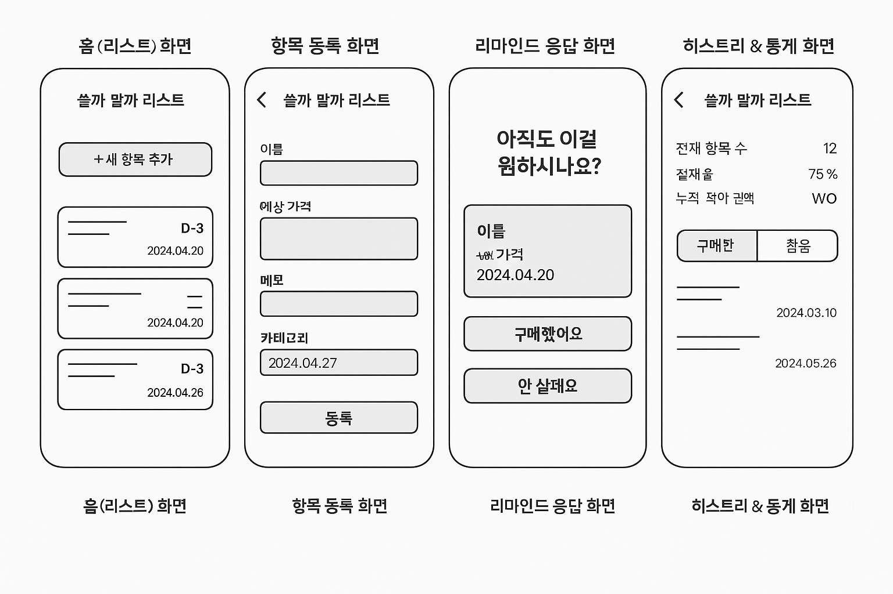
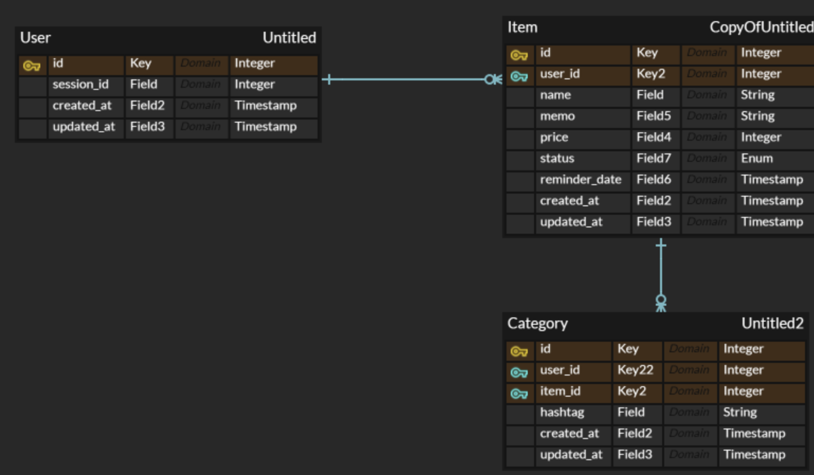

# buy-or-not-backend

## 기획 목표
충동 구매를 줄이고, 진짜 원하는 소비만 하도록 도와주는 미니멀한 소비 유예 앱

## 기능 구성
1. 홈 화면
  - 사용자가 등록한 물건명, 가격 등 정보 조회
2. 항목 등록 화면
  - 사용자가 구매를 고려하는 물건 등록

3. 리마인드 응답 화면
  - 사용자가 설정한 기간인 D-0가 되면, 알림을 전송하여 사용자가 구매할 것 인지 선택하도록 함
4. 히스토리 화면

## 와이어프레임

## ERD

